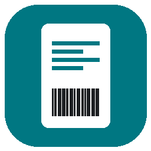

<p align="center">
  
</p>

<h1 align="center">Vinted Label 4x6</h1>

<p align="center">
  Turn Vinted's full-page shipping labels into <b>4×6 thermal labels</b> and print them in one click.<br>
  Works on Windows, macOS and Linux. Everything happens on your computer — nothing is uploaded.
</p>

<p align="center">
  <a href="https://venmo.com/u/heaton0825"></a>
</p>

> 💚 **This app is free and always will be.** I built it for my own Vinted shop. If it saves you time too, a small tip on [Venmo](https://venmo.com/u/heaton0825) is appreciated, but never expected.

<!-- Add a screenshot: save it as docs/screenshot.png and uncomment the next line -->
<!-- <p align="center"></p> -->

---

Vinted only gives you shipping labels as a full Letter/A4 page. If you use a 4×6 thermal label printer (iDPRT SP410, Rollo, MUNBYN, Zebra and similar), that page prints tiny or gets cut off. This app finds the label on the page, crops away the instructions, turns it upright if needed and fits it perfectly on a 4×6 label.

- **Auto-detects the label** on the page. If it guesses wrong, drag a box around the right area.
- **Prints directly** to your label printer, with 1–3 copies.
- **Sharp barcodes**, because it keeps the original vector PDF instead of a blurry screenshot.
- **Save as PDF** if you'd rather print from somewhere else.
- **Light and dark mode**, following your system setting.

## Download

Go to the [**latest release**](../../releases/latest) and download the file for your computer:

| Computer | File |
|---|---|
| Windows 10 / 11 | `VintedLabel4x6-Windows.zip` |
| Mac (Apple Silicon: M1 or newer) | `VintedLabel4x6-macOS.zip` |
| Linux (x64) | `VintedLabel4x6-Linux.tar.gz` |

On an Intel Mac, use [Run from source](#run-from-source) instead.

### First launch

***The app isn't code-signed (that costs money), so your computer will warn you the first time you open it.***

**Windows:** unzip the download and double-click `VintedLabel4x6.exe`. If you see "Windows protected your PC", click **More info → Run anyway**.

**macOS:** unzip the download and drag `VintedLabel4x6.app` into Applications. The first time, **right-click the app → Open → Open**. If macOS still blocks it, go to **System Settings → Privacy & Security** and click **Open Anyway**.

**Linux:** extract the download and run `./VintedLabel4x6`. Printing uses CUPS, which is already installed on most desktop distros.

## How to use it

1. Download your label PDF from Vinted.
2. Drop it onto the app window, or click **Open PDF…**.
3. Check the red box. Everything outside it is dimmed and won't be printed. If the box is wrong, drag a new one on the page.
4. Check the **4×6 result** preview, pick your printer, and click **Print label**.

Keyboard shortcuts: **Ctrl/⌘+O** to open, **Ctrl/⌘+P** to print, **Ctrl/⌘+S** to save as PDF. The app remembers which printer you picked.

## Printer setup

You only need to do this once: set your label printer's default paper size to **4×6 in (100×150 mm)**.

- **Windows:** Settings → Bluetooth & devices → Printers & scanners → *your printer* → Printing preferences.
- **macOS:** add the printer in System Settings → Printers & Scanners, using the driver from the manufacturer if it has one.
- **Linux:** use your printer settings app, or open `http://localhost:631`.

If the label prints small, shifted or across two labels, the paper size is usually the cause.

## Run from source

You'll need [Python 3.9+](https://www.python.org/downloads/). On Linux you'll also need Tk: `sudo apt install python3-tk` or your distro's equivalent.

```bash
git clone https://github.com/YOUR-USERNAME/vinted-label-4x6.git
cd vinted-label-4x6
```

Then on **Windows**, double-click `run.bat`. On **macOS / Linux**, run `./run.sh`. The first run sets everything up in a local `.venv` folder.

It also works from the command line:

```bash
python VintedLabel4x6.py label.pdf --auto    # saves label_4x6.pdf next to it
python VintedLabel4x6.py label.pdf --print   # prints to your saved printer
```

## Build it yourself

```bash
python build.py
```

The finished app ends up in `dist/`. Each operating system builds its own version, so you have to build on the OS you're targeting.

## Troubleshooting

- **The red box grabbed the wrong area.** Drag a new box on the page. **Reset** goes back to the automatic guess.
- **"No printers found".** Make sure the printer is installed in your OS and turned on, then restart the app.
- **Drag-and-drop doesn't work.** Use **Open PDF…** instead, which always works.
- **The label is upside down or sideways.** Use the **Rotation** buttons.

## Disclaimer

This is an independent project. It is not affiliated with, endorsed by or connected to Vinted. It works with any PDF that has a shipping label somewhere on a larger page.

## Support

This app is free. If it helped your shop, you can [leave a tip on Venmo](https://venmo.com/u/heaton0825). Bug reports and ideas are also welcome in [Issues](../../issues).

## License

[MIT](LICENSE)